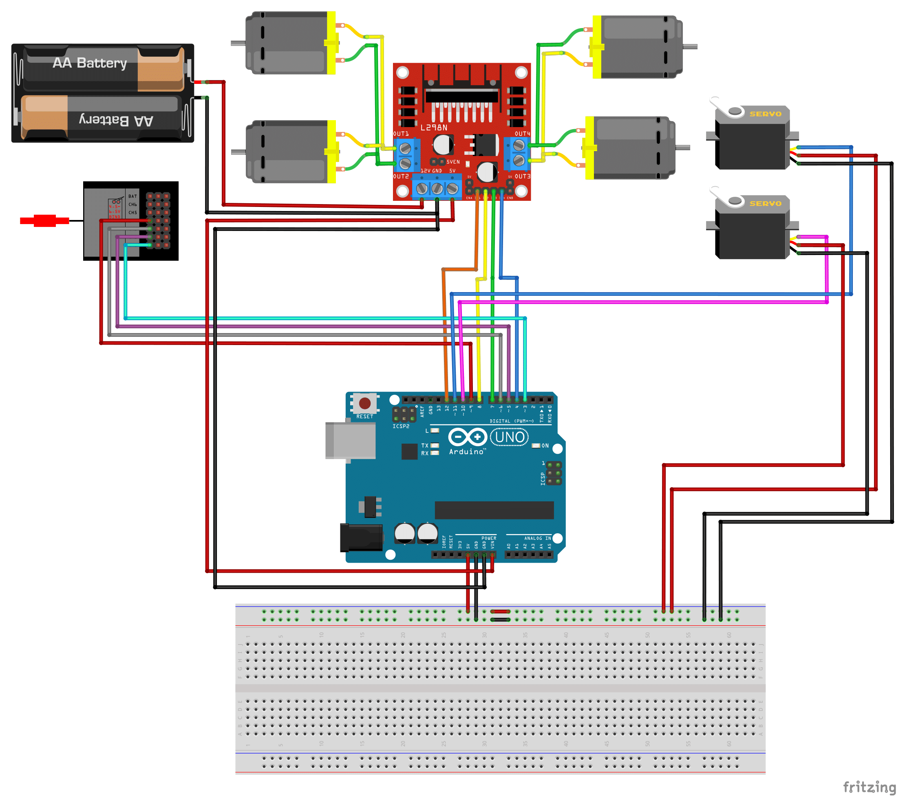

# Assembly of Pick and Place Robot


### Step-by-Step Assembly Instructions:

#### 1. Prepare the Chassis:
- Select a suitable chassis material (plywood, MDF board, etc.).
- Drill holes for wires and motors.

#### 2. Mount the Motors:
- Secure the Johnson motors to the chassis using nuts and bolts.

#### 3. Arrange Electronics:
- Follow the provided schematic to place the electronics.
- Use jumper wires to make the connections.


#### 4. Install the Servos:
- **MG995 Servo:**
  - Mount the MG995 servo on one edge of the chassis.
  - Attach the 3D printed robot arm to the servo.
  *(This servo is meant to controll the movement of arm)*
- **SG90 Servo:**
  - Fix the SG90 servo at the end of the arm.
  - Attach the 3D printed claw fingers to the servo.
   *(This servo is meant to controll the clenching mechanism)*
#### 5. Secure Components:
- Use double-sided tape to secure all components to the chassis.

#### 6. Upload the Code:
- Connect the Arduino Uno to your computer using a USB cable.
- Upload the code given:

```cpp
#include <Servo.h> // Include the Servo library

// Create servo objects for the two servos
Servo myservo1;
Servo myservo2;

// Define input pins for channels
#define CH1 3
#define CH2 5
#define CH3 6
#define CH4 9

// Define output pins for motor control
#define Rm1 4
#define Rm2 7
#define Lm1 8
#define Lm2 12

// Variables to store channel values
int ch1Value;
int ch2Value;
int ch3Value;
int ch4Value;

void setup() {
  // Initialize serial communication at 115200 bps
  Serial.begin(115200);
  
  // Set channel pins as inputs
  pinMode(CH1, INPUT);
  pinMode(CH2, INPUT);
  pinMode(CH3, INPUT);
  pinMode(CH4, INPUT);
  
  // Set motor control pins as outputs
  pinMode(Rm1, OUTPUT);
  pinMode(Rm2, OUTPUT);
  pinMode(Lm1, OUTPUT);
  pinMode(Lm2, OUTPUT);
  
  // Attach the servos to their respective pins
  myservo1.attach(10);
  myservo2.attach(11);
}

void loop() {
  // Read values from the channels
  ch2Value = readChannel(CH2);
  ch1Value = readChannel(CH1);
  ch4Value = readChannel(CH4);
  ch3Value = readChannel(CH3);

  // Motor control
  if (ch2Value > 30) {  // Forward
    digitalWrite(Rm1, LOW);
    digitalWrite(Rm2, HIGH);
    digitalWrite(Lm1, LOW);
    digitalWrite(Lm2, HIGH);
    Serial.println("forward");
  } else if (ch2Value < -30) {  // Backward
    digitalWrite(Rm1, HIGH);
    digitalWrite(Rm2, LOW);
    digitalWrite(Lm1, HIGH);
    digitalWrite(Lm2, LOW);
    Serial.println("backward");
  } else if (ch1Value > 30) {  // Right
    digitalWrite(Rm1, HIGH);
    digitalWrite(Rm2, LOW);
    digitalWrite(Lm1, LOW);
    digitalWrite(Lm2, HIGH);
    Serial.println("right");
  } else if (ch1Value < -30) {  // Left
    digitalWrite(Rm1, LOW);
    digitalWrite(Rm2, HIGH);
    digitalWrite(Lm1, HIGH);
    digitalWrite(Lm2, LOW);
    Serial.println("left");
  } else {  // Stop
    digitalWrite(Rm1, LOW);
    digitalWrite(Rm2, LOW);
    digitalWrite(Lm1, LOW);
    digitalWrite(Lm2, LOW);
  }

  // Servo control for the arm movement
  if (ch4Value > 10) {
    myservo1.write(180); // Move to position 180 degrees
  } else if (ch4Value < -10) {
    myservo1.write(0); // Move to position 0 degrees
  } else {
    myservo1.write(90); // Center position
  }

  // Servo control for the claw clenching
  if (ch3Value > 10) {
    myservo2.write(180); // Move to position 180 degrees
  } else if (ch3Value < -10) {
    myservo2.write(0); // Move to position 0 degrees
  } else {
    myservo2.write(90); // Center position
  }
}


```
#### 7. Final Steps:
- Attach the receiver antenna.
- Your pick-and-place robot is now ready for operation!

**Note:**
You can use scrap wood, plywood, MDF board, or cardboard for the arm and claw instead of a 3D-printed claw. Secure joints using nuts and bolts.


### Selection of components

#####   1. Two Servo Motors for Claw:
   - *Technical Reason*: Servo motors provide precise control of angular position, making them ideal for the claw mechanism. They offer accurate movements required to grasp and release objects.
   - *Logical Reason*: The claw needs to open and close precisely to handle different objects securely. Servos allow for controlled gripping force, preventing damage to delicate items.

##### 2. Four Johnson Motors (150 RPM each):
   - *Technical Reason*: Johnson motors are known for their high torque and speed capabilities, making them suitable for driving the robot's wheels.
   - *Logical Reason*: Four motors ensure stable and balanced movement of the robot, allowing it to navigate and position itself accurately to pick and place objects.

##### 3. 3D Printed Mechanism for Claw:
   - *Technical Reason*: 3D printing allows for custom-designed parts that can be precisely tailored to the specific requirements of the claw mechanism.
   - *Logical Reason*: Custom parts ensure that the claw fits perfectly with the servo motors and can handle the intended range of objects effectively.

 ##### 4. Arduino UNO:
   - *Technical Reason*: The Arduino UNO is a versatile microcontroller with sufficient I/O pins to control multiple motors and sensors.
   - *Logical Reason*: It is easy to program and widely supported, making it a practical choice for prototyping and developing the robot's control system.

##### 5. Jumper Wires:
   - *Technical Reason*: Jumper wires are essential for making temporary connections between the Arduino, motor drivers, servos, and other components.
   - *Logical Reason*: They allow for flexible and quick wiring during the development and testing phases.

##### 6. Motor Driver L298N:
   - *Technical Reason*: The L298N motor driver can control the speed and direction of two DC motors simultaneously and provides the necessary current to drive the motors.
   - *Logical Reason*: It simplifies the control of the Johnson motors and integrates well with the Arduino for easy motor management.

##### 7. Wheels:
   - *Technical Reason*: Wheels are necessary for the robot's mobility and must be compatible with the Johnson motors.
   - *Logical Reason*: They enable the robot to move and navigate to different locations for picking and placing objects.

##### 8. Chassis:
   - *Technical Reason*: The chassis provides a structural base to mount all components securely and maintain the robot's integrity.
   - *Logical Reason*: A sturdy chassis ensures the robot remains stable during operation, preventing tipping or misalignment.

##### 9. Nuts and Bolts (M3-M4):
   - *Technical Reason*: Nuts and bolts provide strong and reliable fastening of the various components to the chassis.
   - *Logical Reason*: Proper fastening ensures that components remain in place during movement and operation, maintaining the robot's functionality.

##### 10. Battery:
   - *Technical Reason*: A battery supplies the necessary power to run the motors, Arduino, and other electronic components.
   - *Logical Reason*: A reliable power source ensures consistent performance and mobility of the robot throughout its operation.

##### 11. Transmitter Remote:
   - *Technical Reason*: The transmitter remote allows for wireless control of the robot, enabling remote operation.
- *Logical Reason*: It provides a convenient way to control the robot's movements and actions from a distance, enhancing usability and flexibility.

 ##### 12. Receiver Antenna:
- *Technical Reason*: The receiver antenna receives signals from the transmitter remote, enabling wireless communication.
- *Logical Reason*: It ensures that commands from the remote are accurately received and executed by the robot, facilitating smooth remote control.

These components together form the essential building blocks of a functional pick and place robot, each playing a crucial role in its operation.


